# Voice Doctor AI

> **A privacy-first, multilingual, fully on-device health-information assistant for Android that accepts speech, retrieves relevant curated medical knowledge locally, runs a lightweight language model on the phone, and returns grounded text or speech without requiring an internet connection for inference.**

---

## 1. Project Vision

Voice Doctor AI is an **offline, voice-first, multilingual health-information assistant** designed for situations where internet access is poor, unreliable, expensive, or unavailable.

A user should be able to speak naturally in a supported language such as **Telugu, Tamil, or English**, describe a health-related question or concern, and receive a concise, understandable response generated completely on the mobile device.

The system is intended to combine:

- offline speech recognition,
- multilingual text processing,
- a lightweight on-device small language model,
- local retrieval-augmented generation (RAG),
- curated medical knowledge,
- medical-safety guardrails,
- optional offline text-to-speech,
- Android hardware acceleration,
- model quantization and memory optimization,
- privacy-preserving local inference,
- on-device performance monitoring.

The long-term language goal is to support a much broader set of Indian languages, while validating each language for speech recognition, retrieval quality, response quality, and safety before considering it production-ready.

---

## 2. Important Product Boundary

Voice Doctor AI is **not a replacement for a doctor, hospital, emergency service, diagnostic test, or licensed medical professional**.

The application is intended to provide:

- general health information,
- low-risk self-care information where appropriate,
- explanations of common health concepts,
- guidance on what kind of professional care may be appropriate,
- escalation when the system detects potentially urgent situations,
- understandable information before or while seeking professional care.

The system must not be designed to promise a diagnosis, guarantee a medical result, or present model output as definitive clinical advice.

When the system lacks sufficient evidence or confidence, it should explicitly communicate uncertainty and recommend appropriate professional evaluation rather than inventing an answer.

---

# 3. Core Product Flow

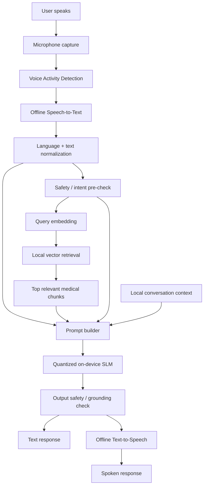

The entire inference path should be capable of running with the device in **airplane mode** after all required models and knowledge assets have been installed.

---

# 4. High-Level System Architecture

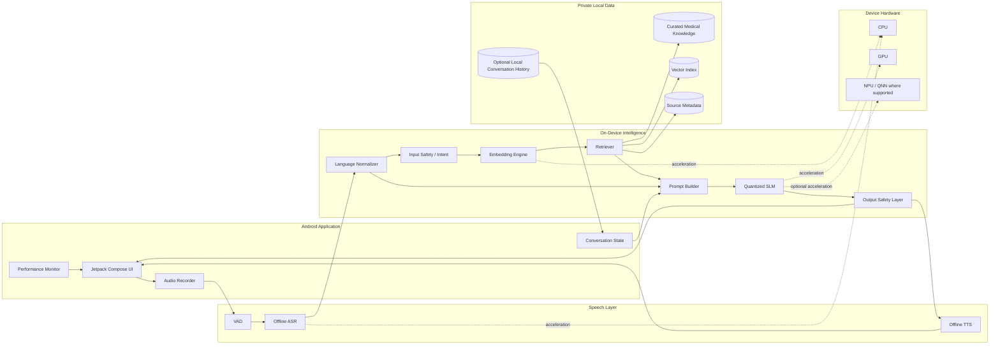

---

# 5. Recommended Technology Stack

## Android Application

| Area | Recommended Stack |
|---|---|
| Language | Kotlin |
| UI | Jetpack Compose |
| Architecture | Clean Architecture + MVVM |
| Async work | Kotlin Coroutines + Flow |
| Dependency injection | Hilt or Koin |
| Local structured data | Room / SQLite |
| Settings | DataStore |
| Native integration | JNI / Android NDK when required |
| Build system | Gradle |
| Testing | JUnit, AndroidX Test, Compose UI Test |
| Benchmarking | Android Macrobenchmark + custom inference metrics |

The AI subsystems should be hidden behind interfaces so that ASR, embedding, LLM, retrieval, and TTS implementations can be replaced without rewriting the UI.

---

# 6. Speech-to-Text Architecture

Speech recognition is the first AI stage.

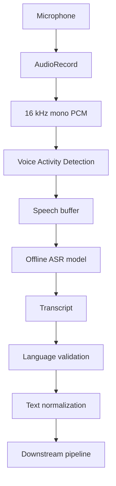

## Preferred ASR candidates

### Option A — whisper.cpp

A strong baseline for the project because:

- it supports Android,
- it runs locally,
- it supports quantized models,
- it has an official Android example,
- tiny/base-class models are practical starting points for mobile experimentation,
- multilingual Whisper checkpoints can be evaluated for Telugu, Tamil, English, and code-switching.

Recommended experimental starting point:

```text
whisper.cpp
+ multilingual tiny/base-class checkpoint
+ Android NDK/JNI
+ quantized weights where useful
```

### Option B — sherpa-onnx

Useful alternative because it provides offline Android support for speech recognition and also provides an architecture that can be used for offline TTS.

It is particularly valuable if a smaller streaming ASR model performs better than Whisper for the target device or language.

## ASR abstraction

```kotlin
interface SpeechRecognizerEngine {
    suspend fun initialize()
    suspend fun transcribe(audio: ShortArray, languageHint: String?): Transcript
    fun release()
}
```

The application should not depend directly on Whisper-specific APIs outside the ASR module.

## ASR evaluation

Measure separately for each supported language:

- Word Error Rate / Character Error Rate,
- proper handling of medical terms,
- accents and regional speech,
- code-switching,
- noisy environments,
- latency,
- memory usage,
- model size,
- battery impact.

For health-related speech, **medical-term transcription accuracy is more important than general conversational accuracy alone**.

---

# 7. Language Processing Layer

After ASR, the transcript passes through a lightweight language-processing stage.

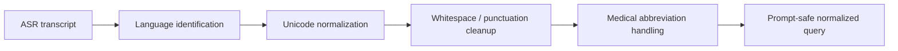

Responsibilities:

- detect or validate language,
- normalize Unicode,
- preserve medically relevant numbers and units,
- handle code-switched text,
- remove ASR artifacts,
- keep the user's original wording available for display,
- produce a normalized text form for retrieval and inference.

For reliability, the UI may allow a user to **select Telugu / Tamil / English explicitly**, while automatic language detection remains available as a convenience.

---

# 8. RAG Architecture

The RAG subsystem is one of the most important parts of Voice Doctor AI.

The language model should not be expected to remember all medical knowledge from model weights alone. Instead, curated reference knowledge is stored locally and retrieved when needed.

## Key rule

**Medical knowledge and user conversation data are different things.**

The user's question must not automatically become part of the trusted medical RAG knowledge base.

---

## 8.1 Offline Knowledge Indexing Pipeline

This pipeline runs during dataset preparation or model-pack creation, not for every user query.

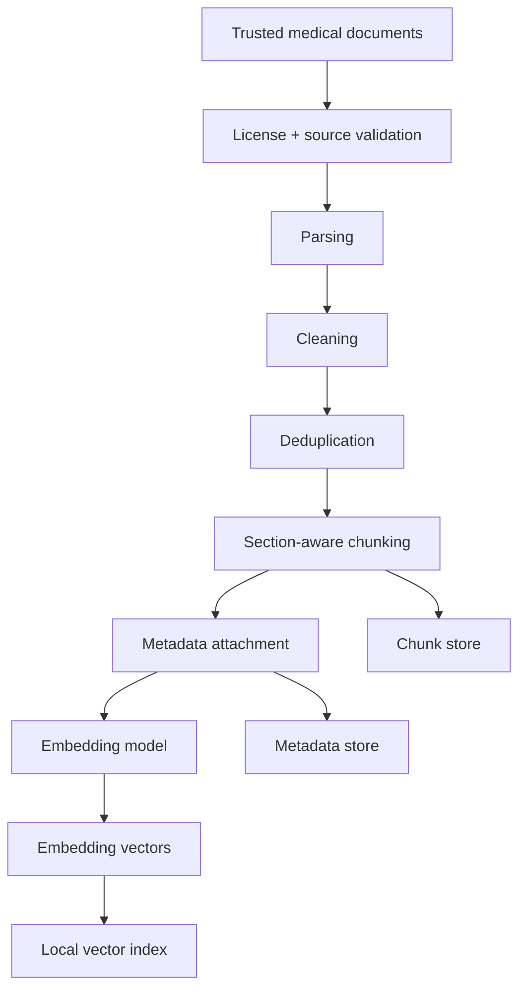

### Example metadata

```json
{
  "chunk_id": "guideline_001_042",
  "source_id": "guideline_001",
  "title": "...",
  "language": "en",
  "section": "...",
  "topic": "...",
  "publication_date": "...",
  "source_type": "clinical_guideline",
  "license": "...",
  "verified": true
}
```

The corpus should be traceable to trusted, licensed sources. Raw documents should not be converted into anonymous chunks with no provenance.

---

## 8.2 Runtime Retrieval Pipeline

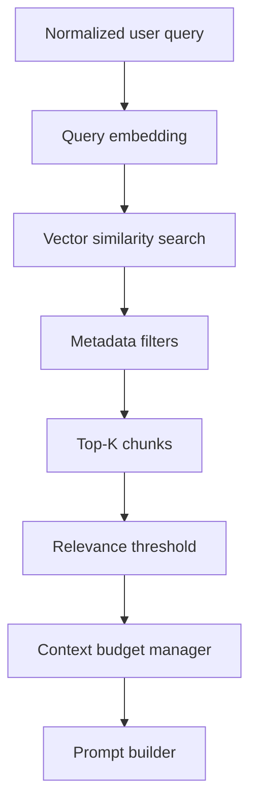

Recommended retrieval behaviour:

1. Embed only the current query at runtime.
2. Keep medical-document embeddings precomputed.
3. Search the local vector index.
4. Retrieve only a small number of highly relevant chunks.
5. Reject low-similarity retrievals rather than forcing unrelated context.
6. Keep source metadata attached to every chunk.
7. Fit retrieved knowledge inside a strict token budget.

This keeps the LLM context short and reduces unnecessary transformer compute.

---

# 9. Embedding Engine

The embedding model is separate from the generative language model.


## Candidate approach

A multilingual sentence-embedding model such as a small multilingual E5-class model can be evaluated for Telugu, Tamil, and English retrieval.

A practical runtime path is:

```text
Embedding checkpoint
        ↓
ONNX / LiteRT-compatible model
        ↓
ONNX Runtime Android or LiteRT
        ↓
Normalized embedding vector
```

`multilingual-e5-small` is a reasonable candidate to benchmark because it is designed as a multilingual embedding model. It must still be tested specifically on the project's Telugu/Tamil medical retrieval set before being selected permanently.

## Embedding interface

```kotlin
interface EmbeddingEngine {
    suspend fun initialize()
    suspend fun embed(text: String): FloatArray
    fun release()
}
```

---

# 10. Local Vector Store

For a compact medical corpus, the project does not initially require a cloud vector database.

Everything should remain local.

Recommended design:

```text
Room / SQLite
├── chunk table
├── source metadata table
├── vector metadata
└── model/index version information

Vector index
├── vector_id
├── chunk_id
├── embedding
└── nearest-neighbour search
```

For a smaller corpus, exact cosine similarity is acceptable and easy to validate.

For a larger corpus, move to an on-device approximate-nearest-neighbour index while preserving the same `Retriever` interface.

```kotlin
interface Retriever {
    suspend fun search(
        queryEmbedding: FloatArray,
        topK: Int,
        filters: RetrievalFilters
    ): List<RetrievedChunk>
}
```

---

# 11. Prompt Construction

The LLM should never receive only the raw user message.

The prompt builder should create a controlled input.

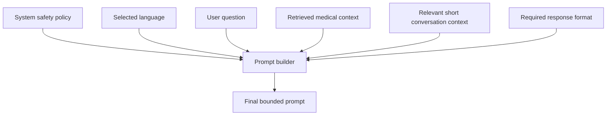

Conceptually:

```text
[SYSTEM POLICY]
You are an offline health-information assistant...

[LANGUAGE]
Respond in the user's selected language.

[MEDICAL CONTEXT]
Trusted retrieved chunks only.

[CONVERSATION CONTEXT]
Only the minimum relevant local history.

[USER QUESTION]
Current user request.

[OUTPUT RULES]
- do not claim certainty when evidence is insufficient
- use retrieved evidence where relevant
- keep the answer understandable
- escalate urgent concerns
- do not present the output as a confirmed diagnosis
```

The prompt builder must enforce a maximum context budget.

---

# 12. On-Device SLM Architecture

The generative model is the core reasoning and response-generation component.

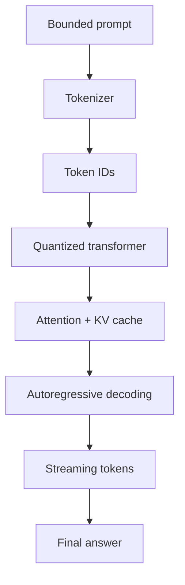

## Recommended starting model/runtime direction

A practical Android baseline is a **quantized approximately 1B-parameter instruction model**.

A particularly useful reference model is:

```text
Gemma 3 1B IT
+ INT4 / Q4 quantization
+ LiteRT-LM
+ Android Kotlin API
+ GPU / CPU
+ Qualcomm QNN/NPU path on supported Snapdragon hardware
```

Current Google AI Edge examples demonstrate Gemma 3 1B-class quantized models running through LiteRT-LM on Android, including a Qualcomm NPU example.

The project must benchmark models instead of assuming that the smallest file automatically gives the best real-device experience.

---

# 13. Attention and Context Efficiency

Voice Doctor AI should **not initially implement a custom attention mechanism**.

The selected SLM already contains its transformer attention architecture.

Instead, make attention cheaper by reducing unnecessary context and using the runtime efficiently.


Primary efficiency techniques:

- small base model,
- INT4 / INT8 quantization,
- short context window,
- strict retrieval top-K,
- relevance thresholding,
- compact prompt templates,
- limited conversation history,
- KV-cache reuse where supported,
- token streaming,
- efficient model loading,
- CPU/GPU/NPU backend selection,
- avoiding repeated embeddings for static documents.

If later research compares different model architectures, models using techniques such as grouped-query or multi-query attention can be benchmarked, but this should be achieved primarily by **choosing an efficient architecture**, not rewriting the transformer's attention implementation inside the Android app.

---

# 14. LiteRT-LM Runtime Layer

LiteRT-LM is a strong default runtime for this repository because it provides an Android/JVM Kotlin API and is specifically designed for edge LLM inference.

Recommended abstraction:

```kotlin
interface LanguageModelEngine {
    suspend fun initialize(modelPath: String)
    fun generate(request: GenerationRequest): Flow<String>
    suspend fun cancel()
    fun release()
}
```

Implementation:

```text
LiteRtLmEngine
    ↓
.litertlm model
    ↓
CPU / GPU backend
    ↓
optional QNN NPU backend on supported Snapdragon hardware
```

The UI should consume tokens as a `Flow` so responses appear progressively rather than waiting for the entire answer.

---

# 15. Qualcomm / Snapdragon Acceleration Path

Qualcomm is highly relevant to this project because the target use case is on-device inference.

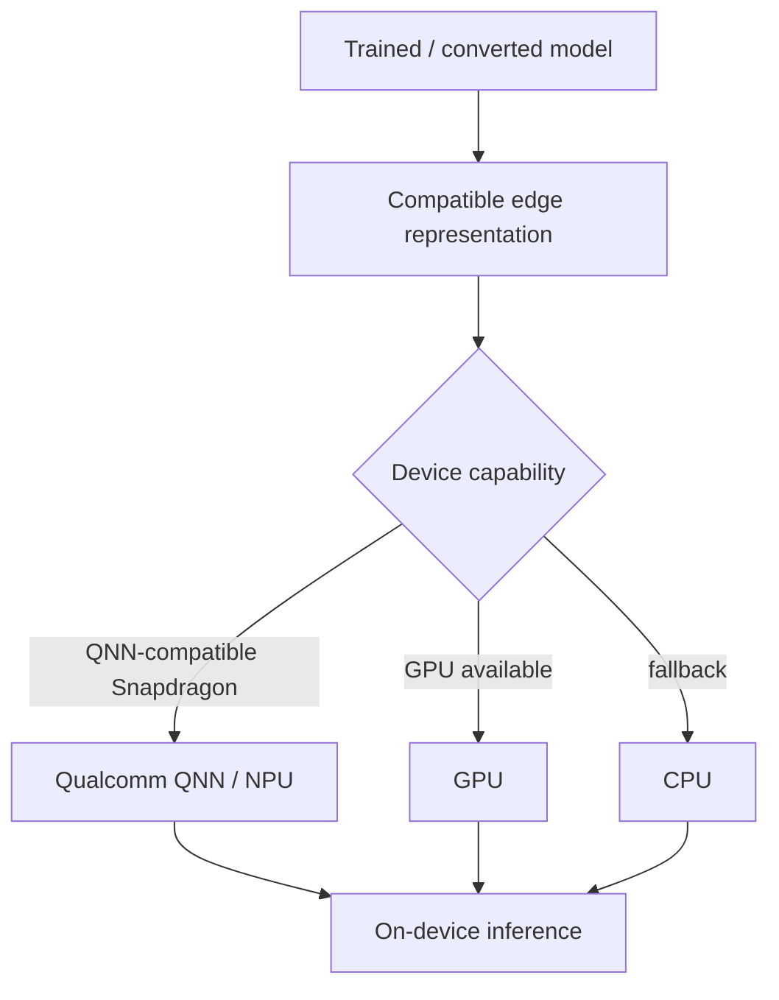

Qualcomm AI tooling can compile supported trained models toward Android-friendly runtimes, including LiteRT/TFLite and Qualcomm QNN representations.

Google's current LiteRT samples also include a Gemma 3 Android path optimized for Qualcomm QNN/NPU hardware.

The application should therefore use a backend capability layer rather than hard-coding one chipset.

```kotlin
sealed interface ComputeBackend {
    data object Cpu : ComputeBackend
    data object Gpu : ComputeBackend
    data object QualcommNpu : ComputeBackend
}
```

---

# 16. Medical Domain Adaptation / Fine-Tuning Pipeline

Model training is performed **off-device**. The resulting optimized model is deployed to Android.

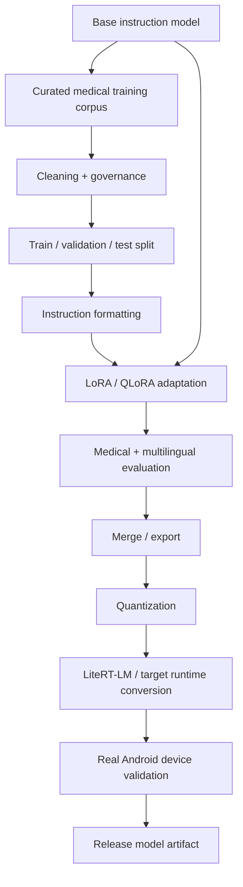

Recommended training ecosystem:

- Python,
- PyTorch,
- Hugging Face Transformers,
- PEFT,
- LoRA / QLoRA,
- TRL where appropriate,
- Accelerate,
- evaluation scripts maintained inside this repository.

## Data rule

Do **not** treat arbitrary raw patient medical records as a normal training source.

Use curated, appropriately licensed medical datasets and guidelines. Any patient-derived data would require strong privacy, consent, de-identification, legal, ethical, and governance controls before it could be considered.

RAG and fine-tuning solve different problems:

```text
Fine-tuning
→ teaches behaviour, style, domain patterns and task following.

RAG
→ supplies current, explicit, traceable knowledge at inference time.
```

The architecture uses both where justified rather than expecting fine-tuning to store all medical facts.

---

# 17. Quantization and Model Optimization

The deployed model should be optimized specifically for mobile constraints.

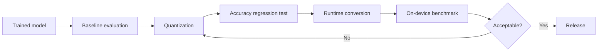

Optimization targets:

- INT4/Q4 weights where quality remains acceptable,
- INT8 where needed,
- reduced model file size,
- lower RAM usage,
- shorter model initialization time,
- lower time-to-first-token,
- higher decode tokens/second,
- stable thermals,
- acceptable battery consumption,
- minimal medical-quality regression after quantization.

Quantization should never be accepted only because the app runs faster. Every quantized model must pass the same safety and quality evaluation suite as the unquantized reference.

---

# 18. Output Safety Architecture

A medical assistant should not expose raw model output directly to the UI without policy checks.

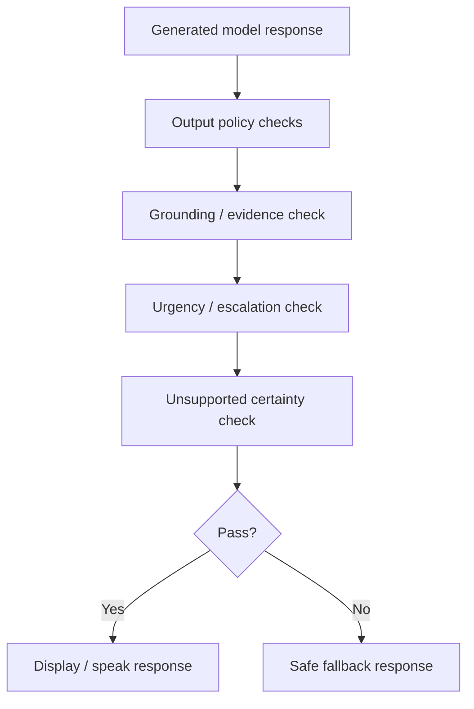

Safety responsibilities include:

- detect when retrieved evidence is absent or weak,
- avoid fabricated certainty,
- detect requests outside intended scope,
- detect potentially urgent health situations,
- direct the user toward professional or emergency care when appropriate,
- avoid pretending the application has performed an examination or test,
- clearly communicate limitations.

Safety logic should combine:

```text
Deterministic rules
+ model-level instructions
+ retrieval confidence
+ structured response checks
+ carefully evaluated fallback messages
```

A single system prompt is not sufficient as the entire safety architecture.

---

# 19. Text-to-Speech Architecture

TTS is optional for inference correctness but important for accessibility and the voice-first experience.

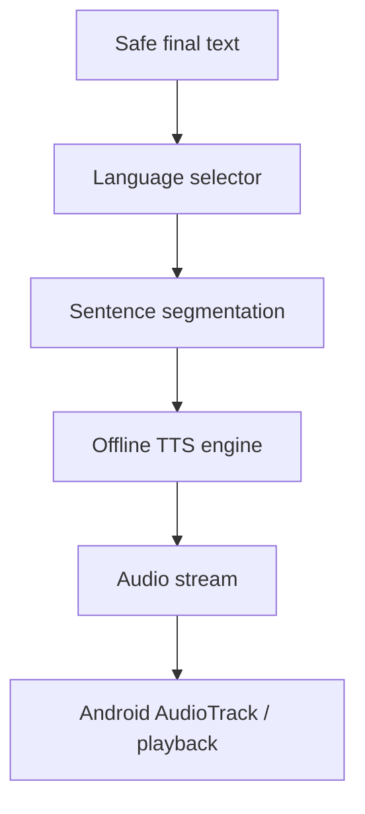

Possible runtime approaches:

- sherpa-onnx TTS for a bundled offline speech stack,
- LiteRT-compatible TTS models where language support is suitable,
- Android TextToSpeech only when an appropriate offline voice package is available on the device.

The project must verify offline Telugu, Tamil, and English voice availability and quality rather than assuming every Android device ships the same voices.

TTS should be implemented behind an interface:

```kotlin
interface TextToSpeechEngine {
    suspend fun initialize()
    suspend fun speak(text: String, language: String)
    fun stop()
    fun release()
}
```

---

# 20. Complete Runtime Sequence

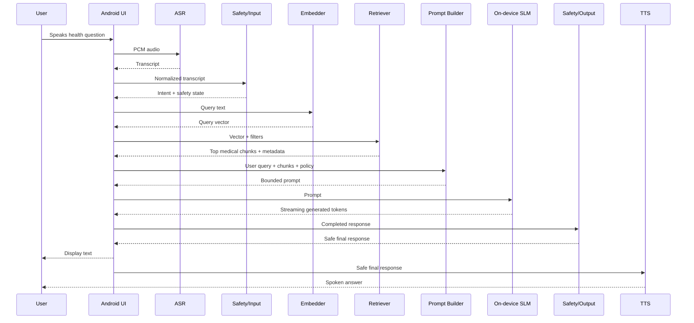

---

# 21. Android Module Architecture

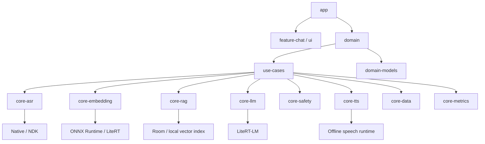

Suggested Gradle modules:

```text
:app
:feature:chat
:core:common
:core:audio
:core:asr
:core:language
:core:embedding
:core:rag
:core:llm
:core:safety
:core:tts
:core:data
:core:model-manager
:core:metrics
```

---

# 22. Suggested Repository Structure

```text
voice-doctor-ai/
│
├── README.md
├── LICENSE
├── CONTRIBUTING.md
│
├── android/
│   ├── app/
│   ├── feature/
│   │   └── chat/
│   ├── core/
│   │   ├── audio/
│   │   ├── asr/
│   │   ├── language/
│   │   ├── embedding/
│   │   ├── rag/
│   │   ├── llm/
│   │   ├── safety/
│   │   ├── tts/
│   │   ├── data/
│   │   ├── model-manager/
│   │   └── metrics/
│   ├── benchmark/
│   └── build-logic/
│
├── ml/
│   ├── datasets/
│   │   ├── README.md
│   │   ├── schemas/
│   │   └── manifests/
│   ├── preprocessing/
│   ├── training/
│   ├── evaluation/
│   ├── quantization/
│   ├── conversion/
│   ├── export/
│   └── notebooks/
│
├── rag/
│   ├── ingestion/
│   ├── cleaning/
│   ├── chunking/
│   ├── embedding/
│   ├── indexing/
│   ├── retrieval_eval/
│   └── schemas/
│
├── models/
│   ├── README.md
│   ├── manifests/
│   └── checksums/
│
├── knowledge/
│   ├── README.md
│   ├── source_manifests/
│   └── licenses/
│
├── safety/
│   ├── policies/
│   ├── rules/
│   ├── test_cases/
│   └── evaluation/
│
├── benchmarks/
│   ├── devices/
│   ├── asr/
│   ├── embeddings/
│   ├── retrieval/
│   ├── llm/
│   ├── tts/
│   └── end_to_end/
│
├── tests/
│   ├── golden/
│   ├── multilingual/
│   ├── medical/
│   └── offline/
│
├── docs/
│   ├── architecture/
│   ├── data-governance/
│   ├── model-card/
│   ├── safety-card/
│   └── evaluation/
│
└── scripts/
    ├── prepare_models/
    ├── build_index/
    ├── validate_assets/
    └── benchmark/
```

Large model binaries, private data, generated vector indexes, and restricted datasets should not be committed directly to Git.

Store manifests, hashes, licenses, conversion scripts, and reproducible build instructions instead.

---

# 23. Model Asset Management

The Android application will potentially contain several large local assets:

```text
ASR model
Embedding model
SLM model
Medical RAG index
TTS model / voices
```

Use a model manifest:

```json
{
  "name": "voice-doctor-model-pack",
  "version": "0.1.0",
  "language_set": ["te", "ta", "en"],
  "llm": {
    "name": "...",
    "format": "litertlm",
    "sha256": "..."
  },
  "asr": {
    "name": "...",
    "sha256": "..."
  },
  "embedding": {
    "name": "...",
    "sha256": "..."
  },
  "knowledge_index": {
    "version": "...",
    "sha256": "..."
  }
}
```

The app should verify checksums before loading model assets.

---

# 24. Local Conversation Memory

Conversation memory and medical RAG must remain separate.

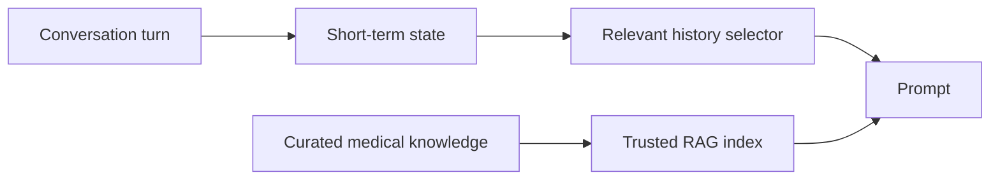

Recommended default behaviour:

- keep only required session context in memory,
- do not permanently store conversations unless the user explicitly enables history,
- do not turn previous model answers into RAG knowledge,
- do not train on local conversations automatically,
- encrypt any persistent health-related history at rest,
- provide a clear delete-history action.

---

# 25. Privacy Architecture

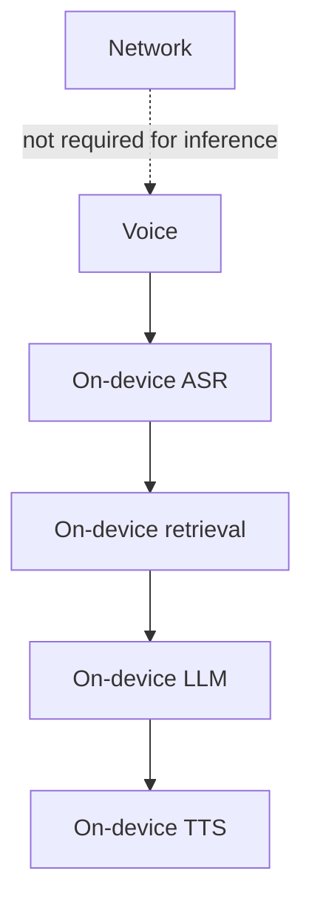

Privacy principles:

- inference should work without internet,
- raw audio should not be uploaded by default,
- prompts should not be uploaded by default,
- retrieved medical context should remain local,
- user conversation history should remain local unless explicit consent says otherwise,
- health information should not be used for analytics by default,
- Android Keystore-backed encryption should protect sensitive persistent data,
- logs must avoid raw health text unless a developer explicitly enables secure debugging.

---

# 26. Medical Knowledge Governance

Every source added to the knowledge base should answer:

```text
Who published it?
Is the source medically credible?
What is the publication/update date?
What license permits its use?
What language is it in?
Was the content transformed or translated?
Who reviewed the transformation?
What topics does it cover?
When should it expire or be reviewed again?
```

Create a source manifest rather than copying documents without provenance.

The medical corpus should prioritize reputable clinical/public-health sources, with clinician review required before making strong medical-safety claims about the system.

---

# 27. Evaluation Architecture

Evaluation is a first-class part of the repository.

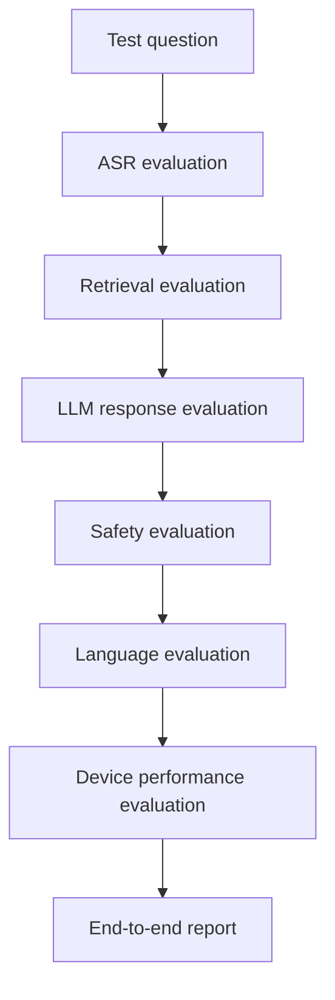

## ASR metrics

- WER / CER,
- medical-term accuracy,
- language identification accuracy,
- latency,
- real-time factor.

## Retrieval metrics

- Recall@K,
- Precision@K,
- MRR / nDCG where appropriate,
- relevant-context coverage,
- language-specific retrieval quality.

## LLM / RAG metrics

- groundedness,
- faithfulness to retrieved context,
- unsupported-claim rate,
- answer relevance,
- response completeness,
- language fidelity,
- code-switch handling.

## Safety metrics

- urgent-case escalation recall,
- unsafe-response rate,
- false reassurance rate,
- unsupported diagnosis-like claims,
- uncertainty calibration behaviour,
- refusal/fallback appropriateness.

## Edge-device metrics

- model initialization time,
- ASR latency,
- embedding latency,
- retrieval latency,
- time to first token,
- decode tokens/second,
- end-to-end latency,
- peak RAM,
- persistent storage,
- CPU/GPU/NPU utilization,
- device temperature,
- battery consumption.

---

# 28. Performance Dashboard

A developer/debug build should expose performance metrics similar to an on-device AI benchmark app.

Example:

```text
Device: Snapdragon ...
Backend: GPU / QNN / CPU

ASR latency:           620 ms
Embedding latency:      35 ms
Retrieval latency:       8 ms
Prompt tokens:         812
TTFT:                  430 ms
Decode speed:         18.4 tok/s
Generated tokens:      147
Peak RAM:              ... MB
Total response time:   ... s
Thermal state:         ...
```

Numbers above are illustrative placeholders only; all real README benchmark values must come from reproducible tests on named physical devices.

---

# 29. Offline Acceptance Test

A release candidate should pass an explicit offline test:

```text
1. Install all required model assets.
2. Enable airplane mode.
3. Restart the application.
4. Record a voice query.
5. Complete ASR locally.
6. Perform local retrieval.
7. Generate the answer locally.
8. Run safety checks locally.
9. Display the answer.
10. Speak the answer locally if TTS is enabled.
11. Verify that no network request was required.
```

This is one of the project's strongest demonstrations.

---

# 30. Error and Fallback Architecture

```mermaid
flowchart TD
    A[User request] --> B{ASR confident?}
    B -->|No| C[Ask user to repeat / show transcript]
    B -->|Yes| D{Retrieval confident?}
    D -->|No| E[Respond with uncertainty / limit scope]
    D -->|Yes| F[LLM generation]
    F --> G{Safety pass?}
    G -->|No| H[Safe fallback / escalation]
    G -->|Yes| I[Return response]
```

The system should fail safely rather than forcing an answer at every stage.

---

# 31. Suggested Core Interfaces

```kotlin
interface SpeechRecognizerEngine
interface LanguageProcessor
interface EmbeddingEngine
interface Retriever
interface PromptBuilder
interface LanguageModelEngine
interface SafetyEngine
interface TextToSpeechEngine
interface ModelManager
interface MetricsCollector
```

The application orchestration layer should depend on these interfaces, not concrete libraries.

This lets the project compare:

- Whisper vs another ASR,
- different embedding models,
- different SLMs,
- CPU vs GPU vs NPU,
- different vector indexes,
- different TTS engines,

without rebuilding the product architecture.

---

# 32. End-to-End Orchestrator

```kotlin
class VoiceDoctorOrchestrator(
    private val asr: SpeechRecognizerEngine,
    private val languageProcessor: LanguageProcessor,
    private val safety: SafetyEngine,
    private val embedder: EmbeddingEngine,
    private val retriever: Retriever,
    private val promptBuilder: PromptBuilder,
    private val llm: LanguageModelEngine,
    private val tts: TextToSpeechEngine,
    private val metrics: MetricsCollector,
)
```

Conceptual flow:

```text
captureAudio()
    ↓
asr.transcribe()
    ↓
languageProcessor.normalize()
    ↓
safety.inspectInput()
    ↓
embedder.embed()
    ↓
retriever.search()
    ↓
promptBuilder.build()
    ↓
llm.generate()
    ↓
safety.inspectOutput()
    ↓
renderText()
    ↓
tts.speak()   [optional]
```

---

# 33. Development Principles

## Build measurable components

Do not treat the product as one black-box AI model.

Measure:

```text
Speech recognition
Retrieval
Generation
Safety
Speech synthesis
```

independently and end-to-end.

## Prefer modularity over premature optimization

First obtain a correct component boundary. Then optimize each component.

## Keep the LLM context small

RAG should reduce context, not make prompts enormous.

## Keep trusted knowledge traceable

Every medical chunk should retain source metadata.

## Benchmark on real phones

Desktop inference results do not represent Android behaviour.

## Never claim medical quality from benchmark speed alone

Fast inference is valuable only when response quality and safety remain acceptable.

---

# 34. What Makes This Project Technically Interesting

Voice Doctor AI combines multiple AI-engineering problems in one deployable product:

```text
Multilingual speech recognition
        +
Edge AI / Android deployment
        +
Small language models
        +
Quantization
        +
RAG
        +
Embeddings
        +
Local vector search
        +
Medical-domain adaptation
        +
Safety engineering
        +
Text-to-speech
        +
CPU/GPU/NPU acceleration
        +
Privacy engineering
        +
Evaluation and benchmarking
```

It demonstrates more than prompting an API. The core engineering challenge is making the complete intelligence pipeline run within the compute, memory, storage, power, and latency constraints of a real Android phone.

---

# 35. Interview / Demo Story

A strong demonstration should look like this:

```text
Phone enters airplane mode
        ↓
Voice Doctor AI opens
        ↓
User selects Telugu
        ↓
User speaks a health-related question
        ↓
Speech is transcribed locally
        ↓
Relevant curated knowledge is retrieved locally
        ↓
Quantized SLM generates a grounded answer locally
        ↓
Safety layer verifies the response
        ↓
Text appears token-by-token
        ↓
Optional Telugu speech is produced locally
        ↓
Developer panel shows latency / RAM / tok-s / backend
```

That demonstrates:

- Android engineering,
- ML integration,
- on-device inference,
- RAG,
- model optimization,
- multilingual AI,
- privacy-first architecture,
- hardware-aware deployment,
- measurable AI performance.

---

# 36. Candidate Technology Matrix

| Component | Primary Direction | Alternatives / Notes |
|---|---|---|
| Android | Kotlin + Jetpack Compose | Native Android first |
| ASR | whisper.cpp | sherpa-onnx; benchmark both |
| VAD | lightweight local VAD | Whisper/speech stack dependent |
| Embeddings | multilingual compact encoder | ONNX Runtime or LiteRT |
| Vector store | local Room/SQLite + vector index | ANN index when corpus grows |
| SLM | ~1B quantized instruction model | benchmark multiple candidates |
| LLM runtime | LiteRT-LM | backend abstraction required |
| Snapdragon acceleration | Qualcomm QNN/NPU | GPU/CPU fallback |
| Fine-tuning | PyTorch + Transformers + PEFT | LoRA / QLoRA |
| Quantization | INT4/Q4, INT8 evaluation | keep quality regression tests |
| TTS | sherpa-onnx / suitable LiteRT model | Android offline TTS where available |
| Local storage | Room / SQLite | encrypted sensitive state |
| Security | Android Keystore-backed protection | no raw health logs by default |
| Benchmarking | Android benchmark + custom metrics | physical-device matrix |

---

# 37. Reference Implementation Direction

The project can learn from current on-device AI work without becoming a copy of a gallery application.

Relevant reference ecosystems include:

- Google AI Edge Gallery,
- Google LiteRT,
- Google LiteRT-LM,
- Google LiteRT Android samples,
- Qualcomm AI Hub / Qualcomm QNN,
- whisper.cpp,
- sherpa-onnx,
- ONNX Runtime Android,
- Hugging Face Transformers,
- Hugging Face PEFT.

The differentiating system is the combination of these ideas into a **multilingual, offline, RAG-grounded, safety-constrained health-information assistant**.

---

# 38. Definition of Success

The project is successful when a supported Android phone can, without network access:

- accept a spoken query,
- transcribe it reliably,
- understand the selected supported language,
- retrieve relevant local medical knowledge,
- construct a bounded evidence-aware prompt,
- run a quantized SLM locally,
- stream a useful response,
- apply medical-safety rules,
- optionally speak the result,
- keep private health content on device,
- expose reproducible performance metrics,
- fail safely when knowledge or confidence is insufficient.

The goal is not simply **"an LLM inside an Android app."**

The goal is a complete **edge-AI health-information system** whose speech, retrieval, model inference, safety, privacy, optimization, and evaluation layers are deliberately engineered for mobile deployment.

---

# 39. Project Status

This repository starts from the architecture and system-design stage.

Implementation decisions should be validated through reproducible experiments before being treated as permanent choices, especially for:

- ASR model selection,
- multilingual accuracy,
- embedding quality,
- medical corpus design,
- base SLM selection,
- fine-tuning strategy,
- quantization level,
- TTS model selection,
- supported hardware backends,
- safety thresholds.

Every major model/runtime change should produce an evaluation and benchmark report.

---

# 40. Safety Notice

Voice Doctor AI is a research and engineering project for offline health-information assistance. It must not be represented as providing guaranteed diagnoses, guaranteed treatment outcomes, or a substitute for professional medical care.

Emergency and high-risk situations require appropriate professional or emergency services. Medical-quality claims should only be made after rigorous evaluation and suitable expert review.

---

## Current Reference Notes — October 2026

The architectural choices above are grounded in currently available on-device tooling:

- Google LiteRT-LM provides a Kotlin API for Android/JVM and supports edge LLM deployment.
- Google AI Edge Gallery and LiteRT samples demonstrate local Android generative-AI inference and performance measurement.
- Current Google model allowlists include quantized Gemma 3 1B-class Android models.
- Google currently provides a Gemma 3 Android sample using a Qualcomm QNN/NPU backend with GPU/CPU fallback.
- whisper.cpp supports Android and provides an Android transcription example.
- sherpa-onnx supports offline Android speech processing.
- Qualcomm AI Hub supports compilation paths for trained models toward Android/Qualcomm runtimes.
- Hugging Face PEFT provides LoRA/QLoRA-style parameter-efficient model adaptation workflows.

Pin exact dependencies and model artifacts in the repository instead of relying on floating "latest" versions.

---

## License

Choose the repository license only after confirming compatibility with every model, dataset, medical source, and third-party dependency included in the project.

Model licenses and dataset licenses may differ from the source-code license and must be tracked separately.

---

**Voice Doctor AI — Private. Multilingual. On-device. Offline-first. Safety-aware.**
